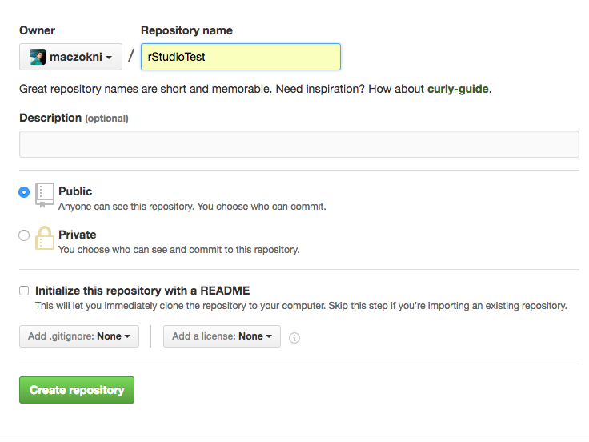
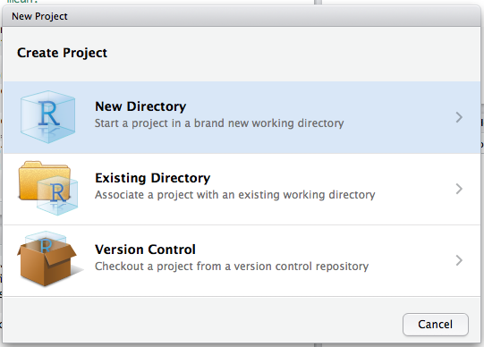

**Table of Contents**

- [What is version control](#sec1)
- [Using GitHub](#sec2)
- [R integration](#sec3)
- [Running Shiny apps](#sec4)


##What is version control {#sec1}

Here's a super simple [video](https://www.youtube.com/watch?v=uS8ROhoLN7Y) that illustrates why we need version control. Git is used for version control. 

It's also important to use version control on non-collaborative projects. It allows for you to save code in order to compile and run, but also to be able to look back into the past for historic version, and essentially have an "undo" button in case you mess something up along the way. 

So let's say you're working on a project. When it's what you are working on, it is called (in version control language) a branch. You make changes to that branch, and you save these changes. When you have made enogh changes for that to be substantial, you commit these changes to your branch. Essentially this means that you're creating an image of your project, as it is in this time. You can revert back to this at any time. 

Your main branch that you're working on is called the "master" branch. You can keep creating save points to the master branch, or if you get to a point where you like how it is, but then you want to create some feature for it, you can create a feature branch. Then you can work on the feature branch, or you can hire someone to work on the feature branch while you can continue to develop the master branch, and then when ready, you can merge that back in, creating a new save point.

GitHub is a social coding platform, it implements git

**Terms**

- *Repository*: Folder where all the code, reference files, and communication about your project takes place
- *Branch*: 
- *Fork*: Making a copy of some existing code, in your own repository, for you to make changes on (that is still linked to the original though)
- *Commit*: Save the changes to your local repository (on your machine)
- *Push*: Send changes to the remote repository 
- *Pull*: Merge changes back to the master branch where you forked from
- *Collaborators*: People who are allowed to make changes to your code without having to submit a pull request

You can find a good beginner overview of references for the commands on how to do these [here](http://www.dataschool.io/git-quick-reference-for-beginners/)

There are a lot more (eg fast forward merge, rebase, 3-way merge, etc) but I'll leave that for future explorations. 

###Looking at an example

So for example let's look at a huge project, such as Hadley Wickam's ggplot2 package for R

You can see the GitHub repository for it [here](https://github.com/hadley/ggplot2)

Here's GitHub in all it's glory. 


So it opens on the code page, and you can see all the code that makes up this package here. You can see that this project is made up of a lot of elements, lots of code, but also you can see there is so much activity that goes into this. This is collaborative coding at its max potential really. 


You can choose to watch it, and if you do you get notifications every time that something happens. 


You can also 'star' it, which is like 'heart'-ing something on twitter in that it serves two purposes: 

- Creating a bookmark for easier access
- Showing appreciation to the repository maintainer for their work


You can also fork the repository. 


This action takes the current version of all the code, and creates a copy as a repository in your own GitHub profile. This is how you take someone else's code and build on it. 


As mentioned, we are currently on the code tab. You can see that one of the tabs is labelled 'Pull requests'. Basically, if you fork a repository, and make some changes, you can merge those changes back into the original source, through this request. This is often reviewed by the person who maintains the code. 


For example here you can see someone who wrote a bit of code to give outliers to violin plots, and their code is currently being checked: 


Another tab that is interesting is the 'issues' tab. This is where you can raise issues with the code if it's something you use. If you have an unresolved issue with ggplot2, that you believe would require fixing, you could raise that here. 


For example, this person has raised an issue about a false warning message using geom_bar():


And also there is the Wiki page for the project, where lots of detail can be found about it: 


Overall you can see that there is a lot going on here. This is a very busy project with many (almost 100!) collaborators, and so it's good to have a browse around it just to explore what sorts of contributions people are making, what communication is going on, how are the versions merged etc. 

<!--However what we want to do is set up something for the R User group (I think?)
-->

##Using GitHub {#sec2}

OK let's get into it. So to create a github account, you'll need to sign up [here](https://github.com/).

Once you have your account, you are ready to start some version control! However you want to be able to work on whatever you're working on on your own pc. To do this, there are many approaches. You can directly connect R Studio to GitHub, which we'll be doing in the next section. 

You can also do this through command line/ terminal. [Here](https://help.github.com/articles/set-up-git/) is the link to some tutorials that help you do that. 

But I guess we should learn some basic commands. To do that let's go through the [try github exercise](https://try.github.io/levels/1/challenges/1). 

What I do is use the GitHub desktop. You can download and set it up [here](https://desktop.github.com/). Some people really don't like it. The main issues with it (I think) are around the limitations. Within the GitHub Desktop interface, there's no way to browse existing issues in a repository, create new ones, or reply to existing items. Instead, you have to follow a link from within the program to the repository on the GitHub site. The same goes for repository wikis or graphs; you must go through the GitHub site to deal with them. However for my basic needs of essentially just archiving my work, it works amazingly. 

You can create a new repository, or you can fork something that's already out there. Let's start by forking something. 

How about that very addicting game from a year and a bit ago 2048? There is a small clone of it [here](https://github.com/gabrielecirulli/2048) that we can try. 

##R integration {#sec3}

With R Studio there is handy integration with GitHub, so you can pull commit and push all from R studio. 

First, you will need to make sure that you have git installed on your computer. 

### Install Git {#install-git}

You need Git, so you can use it at the command line and so RStudio can call it.

Follow the detailed instructions [here](http://happygitwithr.com/install-git.html) for installing git

### Link with GitHub

So again I'm building on instructions from [here](http://happygitwithr.com/push-pull-github.html), but I'll go through it step by step with pics, because everyone likes pics. 

####Create repository
First go to github page with web browser ( [https://github.com](https://github.com) ), and create a new repository using the big greed button:


Give it some name, and then initialise it. 



####Setup git in R Studio

In RStudio, go to Tools -> Global Options, select Git//SVN tab. Ensure the path to the Git executable is correct. This is particularly important in Windows where it may not default correctly (e.g. C:/Program Files (x86)/Git/bin/git.exe).


Most of the time it will default correctly though


####Create RSA key

While here, create an RSA key by clicking on the button


When it's done, click on Close to close the window. 
Then, click on the View public key link, and copy and paste the text in the box which pops up. 


This is your public key to connect to your GitHub account. 

Get back to GitHub and add the key. Click on your profile and go to 'Settings'. Then on the left hand side select 'SSH and GPG keys'


Add a new key by clicking on "New SSH key on the top right corner". Then give the key a name, and paste in what was copied from R Studio into the text box. 


Click "add SSH key "

###Create new project (and git)

In RStudio, click New project as normal. 


Click New Directory.



Name the project and check Create a git repository.


Now in RStudio, create a new script which you will add to your repository.
After saving your new script (test.R), it should appear in the Git tab on the Environment / history panel.


You can commit the changes by ticking the boxes next to them under staged, entering some comments about the commit, and then clicking on the 'Commit' button. 


###Push

To sync your commits back to github, go to Tools> Shell... 


This will open a comms shell, on Mac this will be your terminal. 

Type the following

```{r, eval=FALSE}
git remote add origin https://github.com/maczokni/rStudioTest.git
git config remote.origin.url git@github.com:maczokni/rStudioTest.git
git push -u origin master
```

If you're on a mac, you also need: 

```{r, eval=FALSE}
git config --global credential.helper osxkeychain
```

Ta-daa! You have now pushed your commit to GitHub, and should be able to see your files in your GitHub account. The Pull Push buttons in RStudio will now also work. Remember, after each Commit, you have to Push to GitHub, this doesn’t happen automatically.

You can see more eg how to clone a repository into your R session [here](http://happygitwithr.com/rstudio-git-github.html) and [here](http://happygitwithr.com/existing-github-first.html)

##Running a shiny app {#sec4}

If a shiny application is on github, you should be able to run it from there, without having to download the code. 

You will need to load up shiny library

```{r, eval=FALSE}
library(shiny)
```

And then all you need is 
`runGitHub( "` *name of app* `", "` *name of github account* `")` to run the app

For example, I have an app called "crimeMapTest" in my github, which you can run with the code below: 

```{r, eval=FALSE}
runGitHub( "crimeMapTest", "maczokni") 
```

